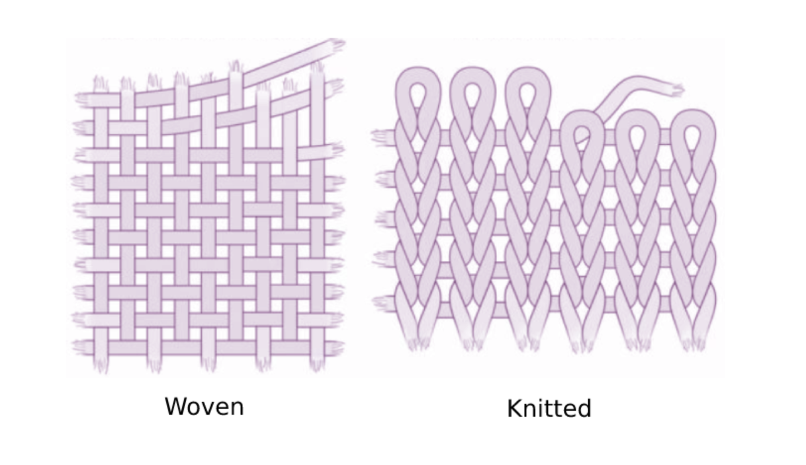

[← Back to Table of Contents](README.md) | [Next: Creating the Template →](02-creating-the-template.md)

# 1. Materials and Fabric Selection

## You Will Need

Not all of the equipment listed below will be used during this workshop, but this is an example of how you can expand your equipment. 

| | |
|---|---|
| A sewing machine | Iron and ironing board/mat |
| Measuring tape and ruler | Scissors |
| Seam ripper | &nbsp;&nbsp;- Fabric scissors |
| Pins or clips | &nbsp;&nbsp;- Optional: Embroidery scissors |
| Tailor's chalk | &nbsp;&nbsp;- Paper scissors |
| Compass tool | &nbsp;&nbsp;- Optional: Pinking shears |
| ⅛-inch quarter batting | Sewing thread and bobbin |
| ⅛-inch quarter fabric (for both inner and outer fabric) | Optional: Embroidery thread |
| Sewing needles | Button |
| | Graph paper |

## Selecting Fabric

The first step in any sewing project is selecting the appropriate fabric. Fabrics differ in their weight, stretch, durability, and ease of sewing, all of which affect the performance of your final design.

For this workshop, we'll be using a **medium-weight woven cotton**. Compared to knit fabrics, woven fabrics have little to no stretch, making them easier to measure, cut, pin, and sew. This stability makes them a good choice for beginners and for projects that require a consistent shape.

| Fabric Type | Characteristics | Best For |
|---|---|---|
| *Woven (e.g., cotton, canvas, denim)* | Little to no stretch, holds its shape, easier to sew | Beginners, structured wearables, device mounting |
| *Knit (e.g., jersey, spandex, athletic fabrics)* | Stretchy, flexible, conforms to the body, can shift while sewing | Form-fitting garments, projects requiring built-in stretch |

Fabric weight is another important consideration:

| Fabric Weight | Characteristics | Typical Uses |
|---|---|---|
| *Lightweight* | Thin, breathable, less durable | Linings, lightweight clothing |
| *Medium-weight* | Balanced strength and flexibility | Most wearable prototypes and general sewing projects |
| *Heavyweight* | Thick, durable, more difficult to sew | Bags, heavy-duty straps, projects supporting larger loads |

Although woven cotton has limited stretch, flexibility can still be added to a design by incorporating elastic straps or bands where movement is needed. This provides a practical way to improve comfort while maintaining the stability of the fabric.

---

[← Back to Table of Contents](README.md) | [Next: Creating the Template →](02-creating-the-template.md)
