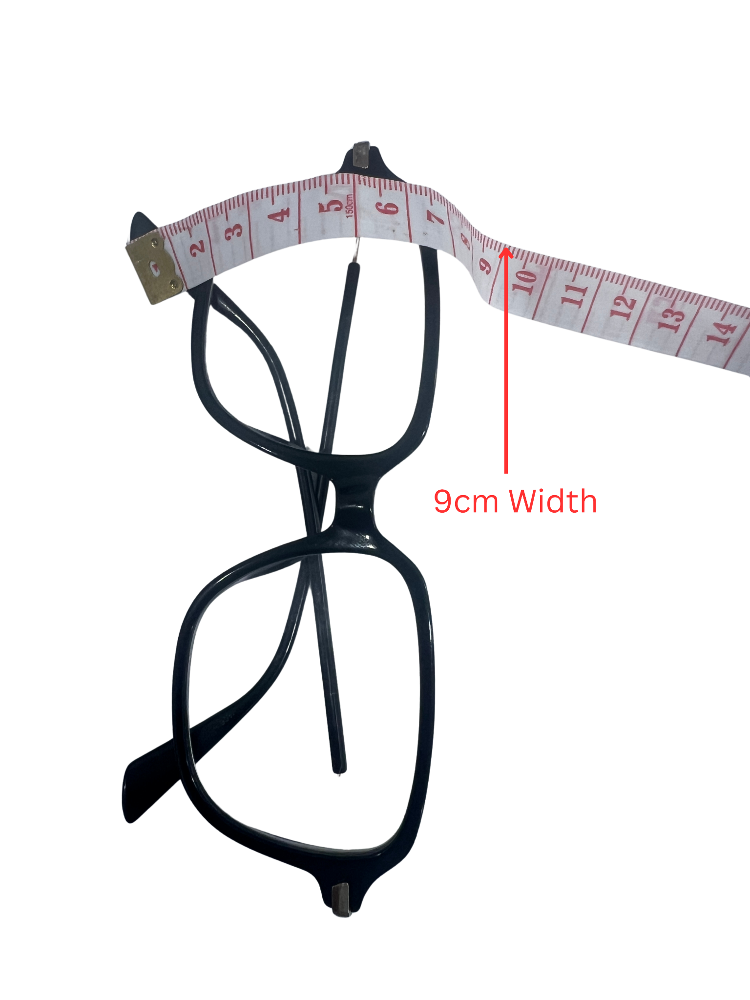
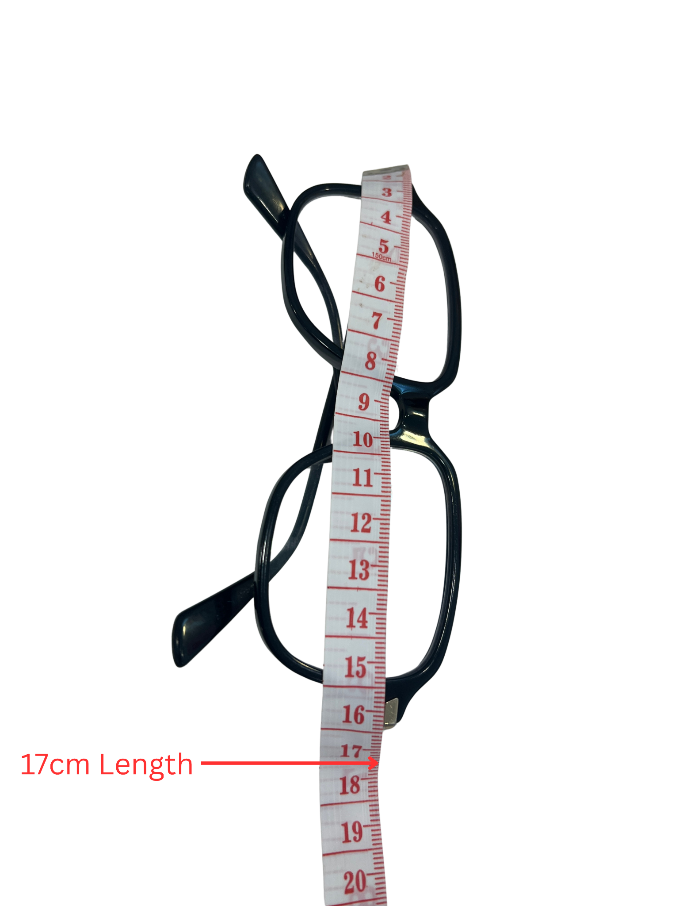
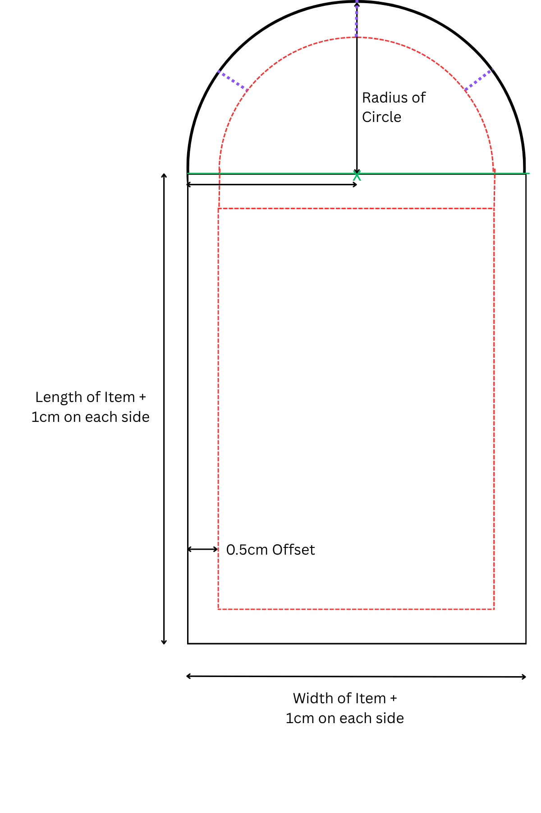

[← Back to Table of Contents](README.md) | [← Previous: Materials and Fabric Selection](01-materials-and-fabric-selection.md) | [Next: Cutting the Fabric →](03-cutting-the-fabric.md)

# 2. Choosing Your Pattern Template

This project uses fusible fleece batting, a soft layer of padding that gets ironed onto the wrong side of your fabric (see [Cutting the Fabric](03-cutting-the-fabric.md) for the fusing steps). It adds cushioning, making wearable devices more comfortable against the body, while also helping the fabric maintain its shape.

Rather than drafting a paper pattern from scratch, this project uses ready-made templates in three sizes — small, medium, and large — which will be pre-printed and available at your station. Each template is a single reusable pattern piece: fold it as marked to cut the front pieces, and leave it unfolded to cut the back pieces.

### Step 1: Measure Your Item

- Measure the length and width of the item you would like to store (in this tutorial, a pair of glasses).
- Measure the longest point for the length.
- Measure the widest point for the width.
- Since your glasses are three-dimensional, measure *over* the glasses from one side to the other rather than measuring straight across. This ensures there is enough room for the glasses to fit comfortably inside the case.

<table>
<tr>
<td></td>
<td></td>
</tr>
</table>

### Step 2: Pick Your Template Size

Compare your measurements to the chart below and choose the smallest size that comfortably fits your item, then grab the matching pre-printed template from your station.

| Size | Width | Length |
|---|---|---|
| Small | up to 7.5 cm | up to 16 cm |
| Medium | 7.5–9 cm | 16–17.5 cm |
| Large | 9–13 cm | 17.5–20 cm |

If your width and length fall into different size rows, use the larger of the two sizes.

<strong>For facilitators:</strong> printing the templates

 

Source files are in [templates/](templates/). The Small and Medium templates both fit on standard letter paper — [pattern-piece-small-and-medium.pdf](templates/pattern-piece-small-and-medium.pdf) has both on one sheet, or print [pattern-piece-small.png](templates/pattern-piece-small.png) / [pattern-piece-medium.pdf](templates/pattern-piece-medium.pdf) separately. The Large template requires legal-size paper: [pattern-piece-large-legal.pdf](templates/pattern-piece-large-legal.pdf). Print at 100% scale (no "fit to page" scaling), then cut out each template along the outer edge before the workshop.

### Reading the Template

- **Solid black line:** cut line for the outer fabric and lining.
- **Solid green line:** fold line — fold the template here when cutting the **front** pieces (fabric and lining). Leave the template unfolded when cutting the **back** pieces.
- **Dashed red line:** cut line for the fusible fleece. It sits 0.5 cm inside the fabric cut line so the fleece doesn't get caught in the seam allowance. Fold along this line the same way when cutting the fleece front piece.

Full cutting instructions for each piece are in [Cutting the Fabric](03-cutting-the-fabric.md).

<strong>Advanced: Drafting a Custom Template</strong> (only needed if your item is significantly larger than 13 cm × 20 cm, or an unusual shape)

 

If your measurements don't fit any of the three sizes above, you can draft your own template by hand:

1. **Add a seam allowance.** Add a 1 cm seam allowance to all sides of your measured width and length. A seam allowance is the extra fabric around the edge that will be sewn together — this is what keeps your project from ending up smaller than intended once it's finished.
2. **Draw the template.** Draw a rectangle using the finished dimensions plus the seam allowance, then create the curved flap by drawing a semicircle with a radius equal to half of the width — see the anatomy diagram above for how the fold, cut, and fleece lines relate to these measurements.
3. **Cut out the paper template** along the outside edge.

---

[← Back to Table of Contents](README.md) | [← Previous: Materials and Fabric Selection](01-materials-and-fabric-selection.md) | [Next: Cutting the Fabric →](03-cutting-the-fabric.md)
