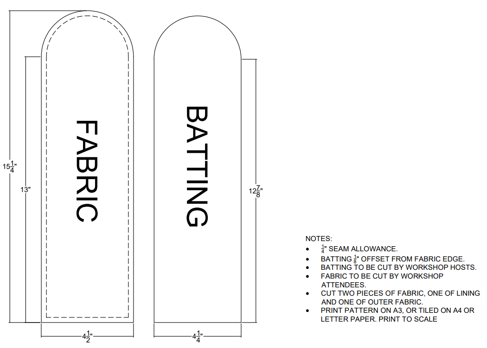

[← Back to Table of Contents](README.md) | [← Previous: Materials and Fabric Selection](01-materials-and-fabric-selection.md) | [Next: Cutting the Fabric →](03-cutting-the-fabric.md)

# 2. Choosing Your Pattern Template

This project uses fusible fleece batting, a soft layer of padding that gets ironed onto the wrong side of your fabric (see [Cutting the Fabric](03-cutting-the-fabric.md) for the fusing steps). It adds cushioning, making wearable devices more comfortable against the body, while also helping the fabric maintain its shape.

Rather than drafting a paper pattern from scratch, this project uses a ready-made template — which will be pre-printed and available at your station.

The fabric and batting templates measurements are below and these templates are pre-measured to fit a standard glasses size, however you can follow the measuring steps below if you would like to measure a smaller or bigger item to fit in the pouch for your own project outside the workshop. 

### Measuring Example

- Measure the length and width of the item you would like to store (in this tutorial, a pair of glasses).
- Measure the longest point for the length.
- Measure the widest point for the width.
- Since your glasses are three-dimensional, measure *over* the glasses from one side to the other rather than measuring straight across. This ensures there is enough room for the glasses to fit comfortably inside the case.

<table>
<tr>
<td></td>
<td></td>
</tr>
</table>

### Reading the Template

- **Solid black line:** cut line for the fabric and batting.
- **Dashed black line:** gives a rough idea of how the batting should fit on the fabric.

Full cutting instructions for each piece are in [Cutting the Fabric](03-cutting-the-fabric.md).

<strong>Advanced: Drafting a Custom Template</strong> (if you want to make this shape with different dimensions)

 

If your measurements does not fit the size above, you can draft your own template by hand:

1. **Add a seam allowance.** Add a 1 cm seam allowance to all sides of your measured width and length. A seam allowance is the extra fabric around the edge that will be sewn together — this is what keeps your project from ending up smaller than intended once it's finished.
2. **Draw the template.** Draw a rectangle using the finished dimensions plus the seam allowance, then create the curved flap by drawing a semicircle with a radius equal to half of the width — see the anatomy diagram above for how the fold, cut, and fleece lines relate to these measurements.
3. **Cut out the paper template** along the outside edge.

---

[← Back to Table of Contents](README.md) | [← Previous: Materials and Fabric Selection](01-materials-and-fabric-selection.md) | [Next: Cutting the Fabric →](03-cutting-the-fabric.md)
