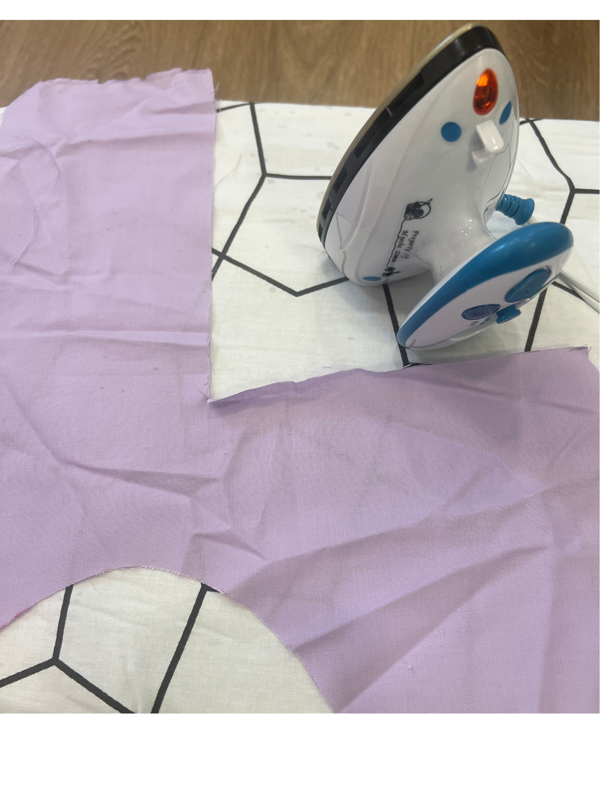
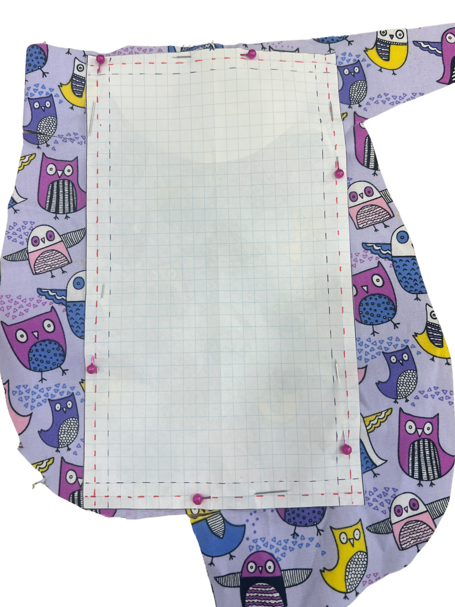
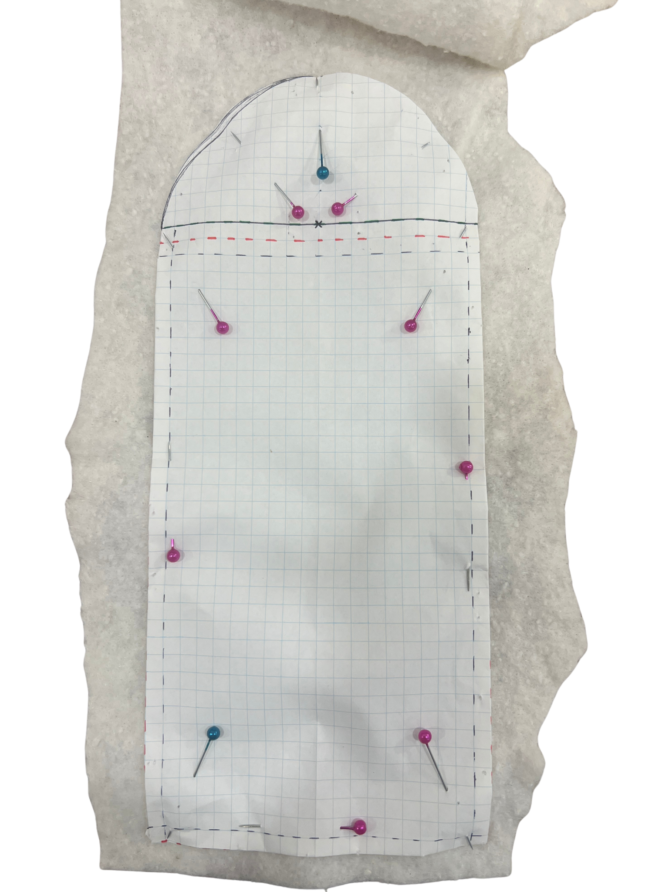

[← Back to Table of Contents](README.md) | [← Previous: Creating the Template](02-creating-the-template.md) | [Next: Threading the Machine →](04-threading-the-machine.md)

# 3. Cutting the Fabric

Before cutting, press your cotton fabric using an iron set to high heat with steam. Pressing removes wrinkles and helps ensure your pattern pieces are cut accurately. The fusible fleece does not need to be pre-pressed — it will be ironed on in the fusing step below.

To cut the **back pieces**, pin the paper template as-is to the outer fabric and cut around them as closely as possible using fabric scissors. Repeat this for the inner lining. You should have 2 back pieces when you are done cutting.

To cut the **front pieces**, fold the template along the green line and pin to the outer fabric. Repeat the steps used for the back pieces. You should have 2 front pieces following this.

To cut the **fusible fleece back piece**, fold the template along the red dotted line (including the semicircle above). Pin and cut as previously. For the **fusible fleece front piece**, fold along the red dotted line parallel to the green line — you should have a rectangular shape. Again, pin and cut.

You should now have 2 back pieces, 2 front pieces, and 2 pieces of fusible fleece.

## Fusing the Fleece to the Fabric

Unlike sew-in batting, fusible fleece is ironed onto the fabric rather than stitched down. Do this for both the front assembly and the back assembly, fusing each fleece piece to the wrong side of either the outer fabric or the lining piece — pick one layer per assembly and stay consistent.

1. Lay your fabric piece **wrong side up** on the ironing surface.
2. Place the fleece piece on top with its bumpy, fusible side facing down against the fabric, centered so there's an even margin of fabric showing around all edges (this matches the 0.5 cm offset marked on the template).
3. Lightly spray the fleece with water.
4. Using an iron on a medium/wool setting, press for 10–15 seconds per section. Lift and place the iron rather than sliding it — sliding can shift the fleece out of position before it bonds.
5. Move to the next section, overlapping slightly, until the whole piece is fused. Let it cool before handling.

---

[← Back to Table of Contents](README.md) | [← Previous: Creating the Template](02-creating-the-template.md) | [Next: Threading the Machine →](04-threading-the-machine.md)
