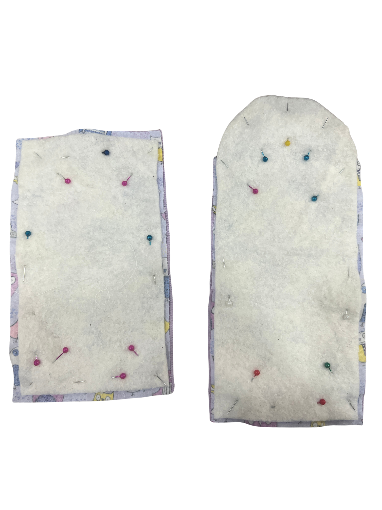
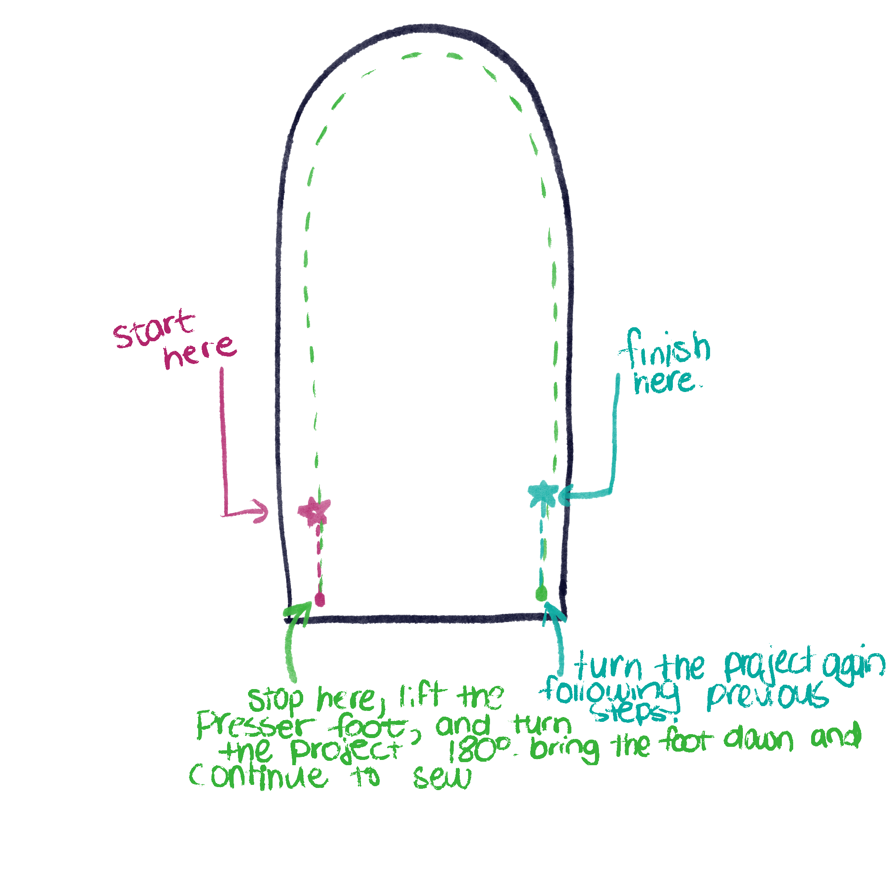

[← Back to Table of Contents](README.md) | [← Previous: Threading the Machine](04-threading-the-machine.md) | [Next: Trimming and Turning →](06-trimming-and-turning.md)

# 5. Pinning and Sewing the Front and Back Pieces

With the right sides of the fabric facing each other, align the batting and purple piece with the patterned piece. Secure the edges using sewing pins or clips, placing them perpendicular to the edge of the fabric.

Before you start sewing, decide if you would like a loop around your button instead of a button hole to close the fabric. If your answer is yes, take a paracord loop from the station and insert it backwards in your pinned fabric as shown below (this positioning insures that the loop will be right side out when flipped). 

Now you are ready to use the sewing machine! Ensure your machine is set to straight stitching with medium tension and length. Be sure to test the stitches on a scrap piece of fabric before sewing your project. Begin sewing at the edge of your batting, ensuring it is also being stitched. A workshop staff will help you get started with the machine. 

Remember to backstitch at the beginning and end of each seam. Backstitching locks the stitches in place and prevents them from coming undone. You can backstitch by following the steps below. If you have included paracord, make sure to backstitch over it to ensure that it is secured. 

**Important:** Leave about a 2" gap on one of the straight sides open. This opening will be used later to turn the pouch right-side out. Sew slowly around the curved flap, removing pins as you approach them. Do not sew over pins, as this can damage the needle or sewing machine. Feel free to stop the machine at any time and pivot the fabric. 

---

[← Back to Table of Contents](README.md) | [← Previous: Threading the Machine](04-threading-the-machine.md) | [Next: Trimming and Turning →](06-trimming-and-turning.md)
