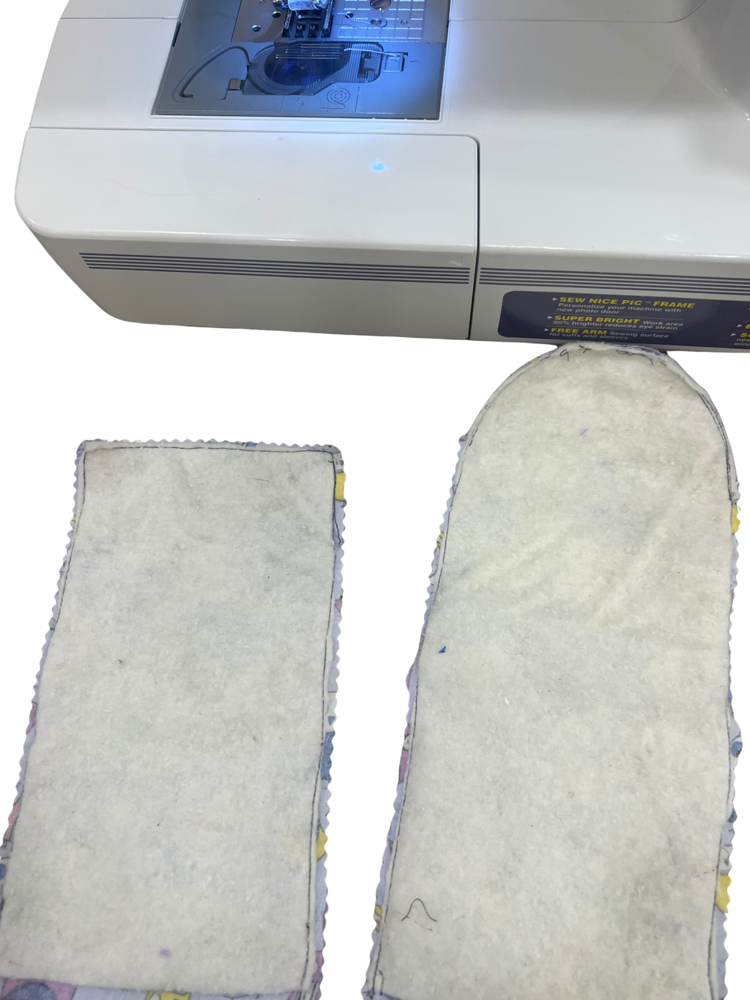
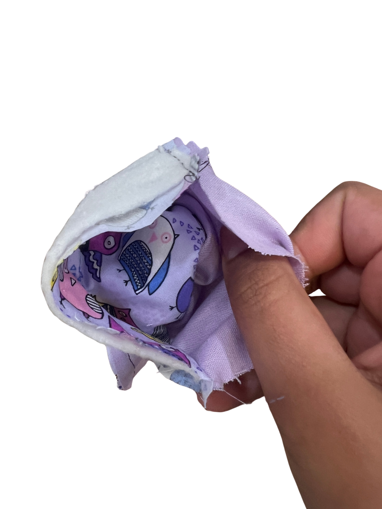
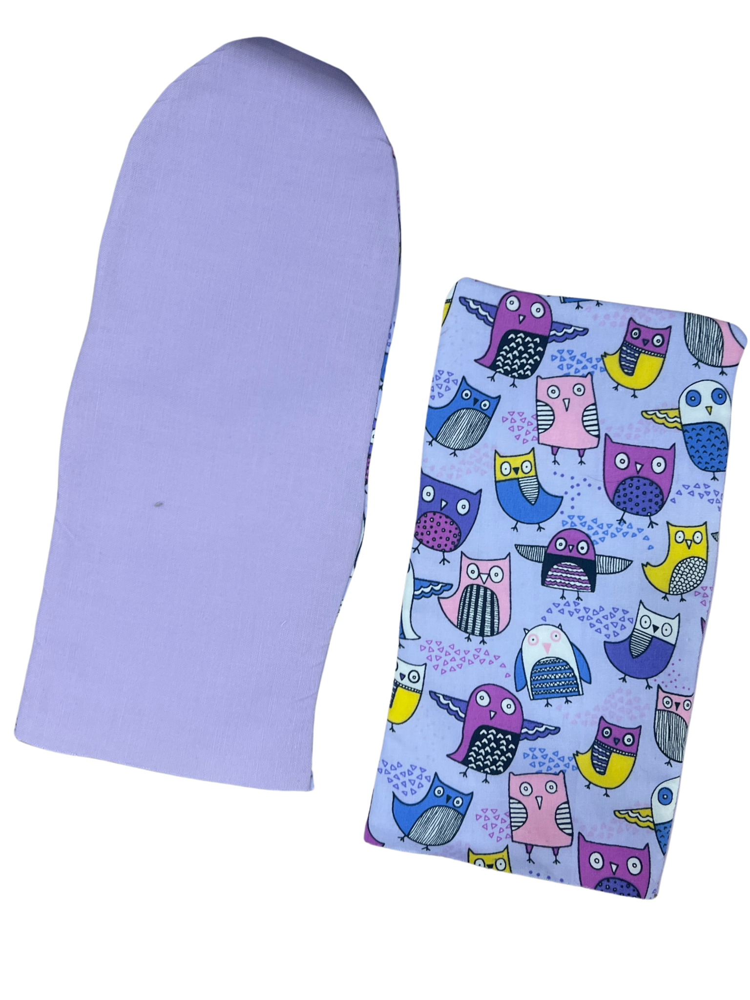

[← Back to Table of Contents](README.md) | [← Previous: Sewing the Front and Back Pieces](05-sewing-front-and-back-pieces.md) | [Next: Adding Quilting Lines →](07-adding-quilting-lines.md)

# 6. Trimming the Seam Allowance

Once the pieces have been sewn together, trim the seam allowance to reduce bulk.

If available, use pinking shears to trim the curved edges. Unlike regular scissors, pinking shears create a zigzag edge that helps reduce fabric fraying while making curved seams smoother once turned right-side out. If you do not have pinking shears, carefully cut small notches into the curved seam allowance without cutting through the stitches. These notches will allow for smoothness along a curve.

Turn both the outer fabric and lining right-side out through the opening left along the bottom edge, ensuring that the batting is inside and the right sides of the fabric are on the outside. You can use a blunt tool, such as the end of a pencil or chopstick, to gently push out the rounded flap.

Press both pieces flat with an iron before continuing.

---

[← Back to Table of Contents](README.md) | [← Previous: Sewing the Front and Back Pieces](05-sewing-front-and-back-pieces.md) | [Next: Adding Quilting Lines →](07-adding-quilting-lines.md)
