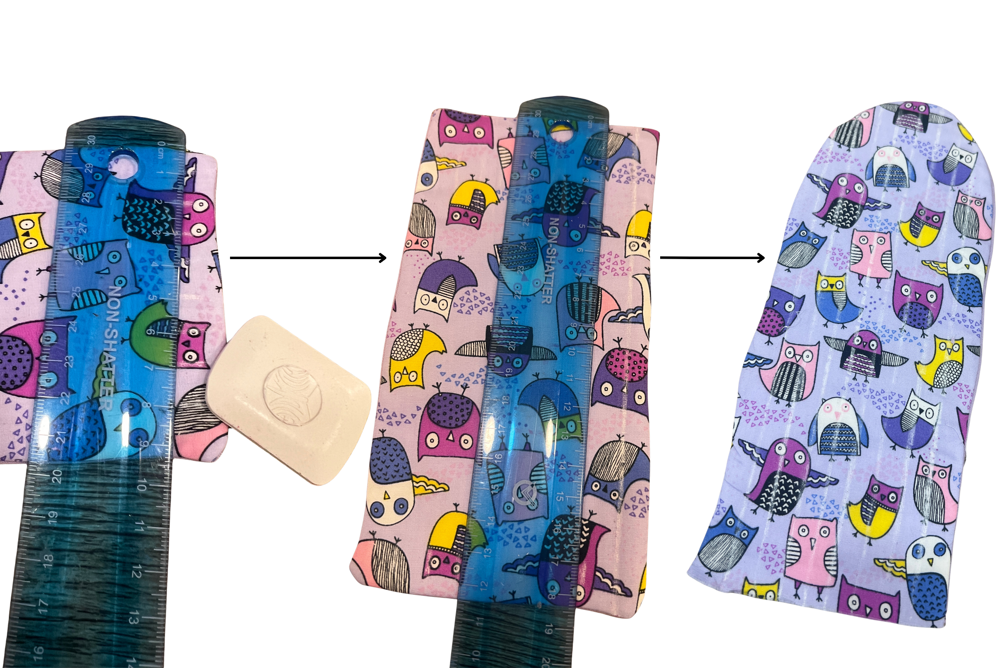

[← Back to Table of Contents](README.md) | [← Previous: Trimming and Turning](06-trimming-and-turning.md) | [Next: Closing the Bottom Edge →](08-closing-the-bottom-edge.md)

# 7. Adding Quilting Lines

Once the two sides have been pressed and turned right-side out, you can add quilting lines to improve the appearance of the pouch and create channels that can be used to route wires in future wearable electronics projects.

Using a ruler and tailor's chalk, measure and mark vertical lines 1 cm apart across the pouch. Ensure the lines are straight and evenly spaced. Sew along each marked line using the same machine settings used previously. Backstitching is not necessary, as these quilting lines are decorative and are only used to hold the layers together and create wire channels.

If you do not have a method to mark the fabric available, you can fold the piece in half and see what icon marks the middle. You can then sew along that icon line. To do the other two lines you can fold each half created by the first line and find the icon marking the middle there and sew along them. 

If incorporating electronics into your design, these quilted channels can help organize and route wires neatly through the fabric. Components can also be secured by hand using embroidery thread to the batting before sewing it down.

**Important:** Avoid sewing over electronic components or wires with a sewing machine.

---

[← Back to Table of Contents](README.md) | [← Previous: Trimming and Turning](06-trimming-and-turning.md) | [Next: Closing the Bottom Edge →](08-closing-the-bottom-edge.md)
