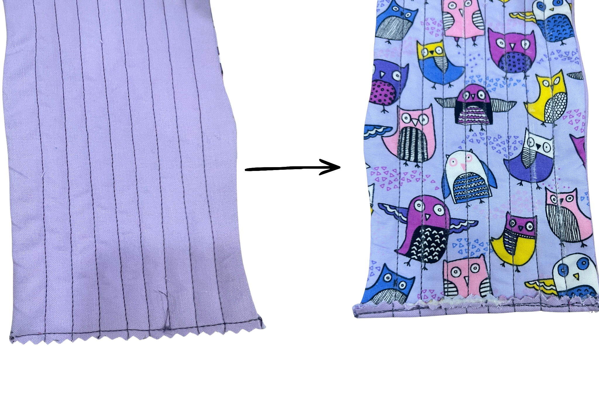

[← Back to Table of Contents](README.md) | [← Previous: Adding Quilting Lines](07-adding-quilting-lines.md) | [Next: Folding and Sewing the Piece Together →](09-folding-and-sewing-the-piece-together.md)

# 8. Closing the Opening

The opening will be closed by hand sewing a blanket stitch. You can ask a workshop staff to guide you through the procedure and/or follow the linked videos below. 

First put thread the needle using roughly 2' of thread and fold it in half and tie a knot to secure it ([tying a knot on a needle video](https://www.youtube.com/shorts/R-IbkK9Gpo8)) - the folded thread should be about 1' in length. 

Then start your blanket stitch by putting the needle through one piece of the fabric and follow this [blanket stitch video](https://www.youtube.com/shorts/GvSZg4jVDco) to do a blanket stitch. 

Once you have closed the opening, end your blanket stitch by following this [ending a blanket stitch video](https://www.youtube.com/shorts/tblAZUG21kk). 

---

[← Back to Table of Contents](README.md) | [← Previous: Adding Quilting Lines](07-adding-quilting-lines.md) | [Next: Folding and Sewing the Piece Together →](09-folding-and-sewing-the-piece-together.md)
