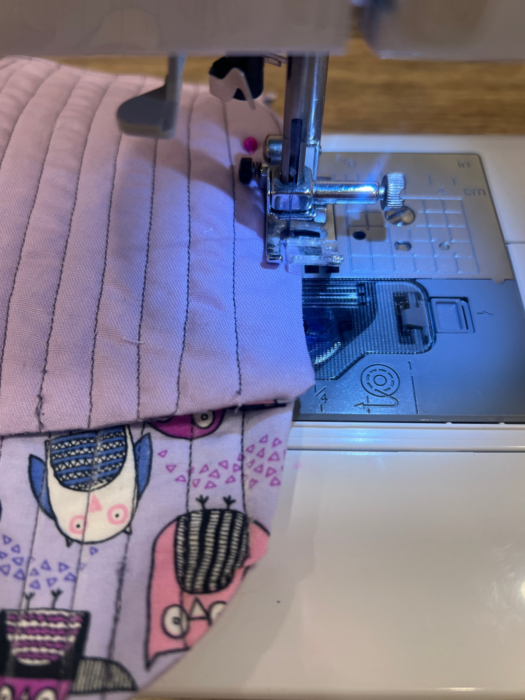
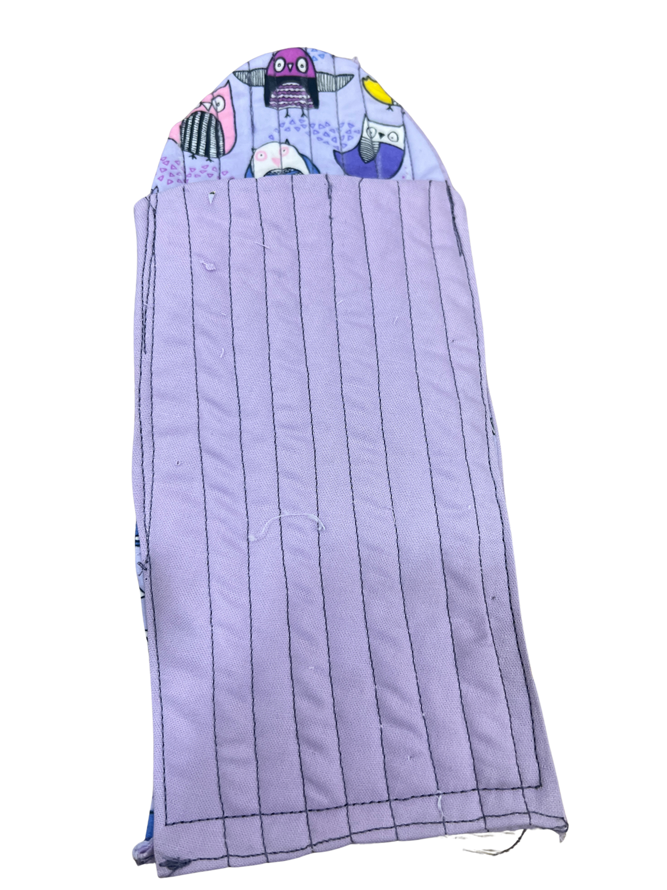

[← Back to Table of Contents](README.md) | [← Previous: Closing the Bottom Edge](08-closing-the-bottom-edge.md) | [Next: Buttonhole and Button →](10-buttonhole-and-button.md)

# 9. Sewing Both Pieces Together

Fold the piece with the purple side facing out and patterned side facing in roughly in half and leave the semi-circle section at the top as that will be your opening/closing flap. 

Before you start sewing, decide if you would like a paracord loop on the side of your fabric which you can use to hang the pouch (eg. from a carabiner). If your answer is yes, take a paracord loop from the station and insert it backwards in your pinned fabric as shown below (this positioning insures that the loop will be right side out when flipped). 

Using the same machine settings as before, sew around the sides and bottom of the pouch using approximately a 0.5 cm seam allowance. Backstitch at the beginning and end of the seam to secure it.

Turn the entire pouch right-side out by pulling it through the opening.

<table>
<tr>
<td></td>
<td></td>
</tr>
</table>

---

[← Back to Table of Contents](README.md) | [← Previous: Closing the Bottom Edge](08-closing-the-bottom-edge.md) | [Next: Buttonhole and Button →](10-buttonhole-and-button.md)
