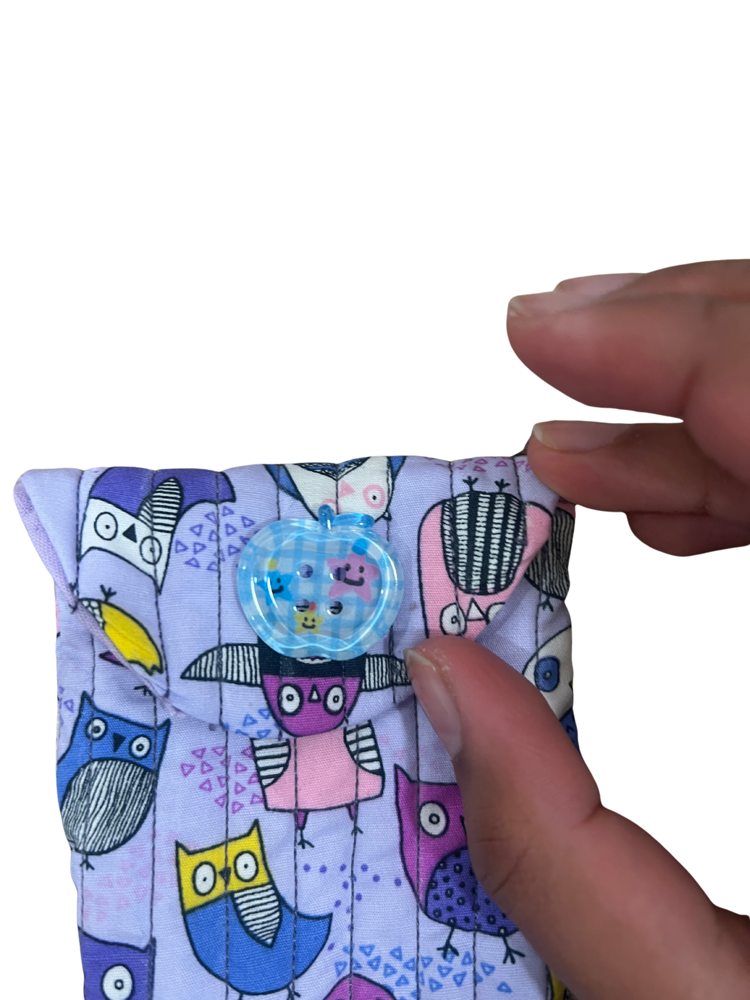
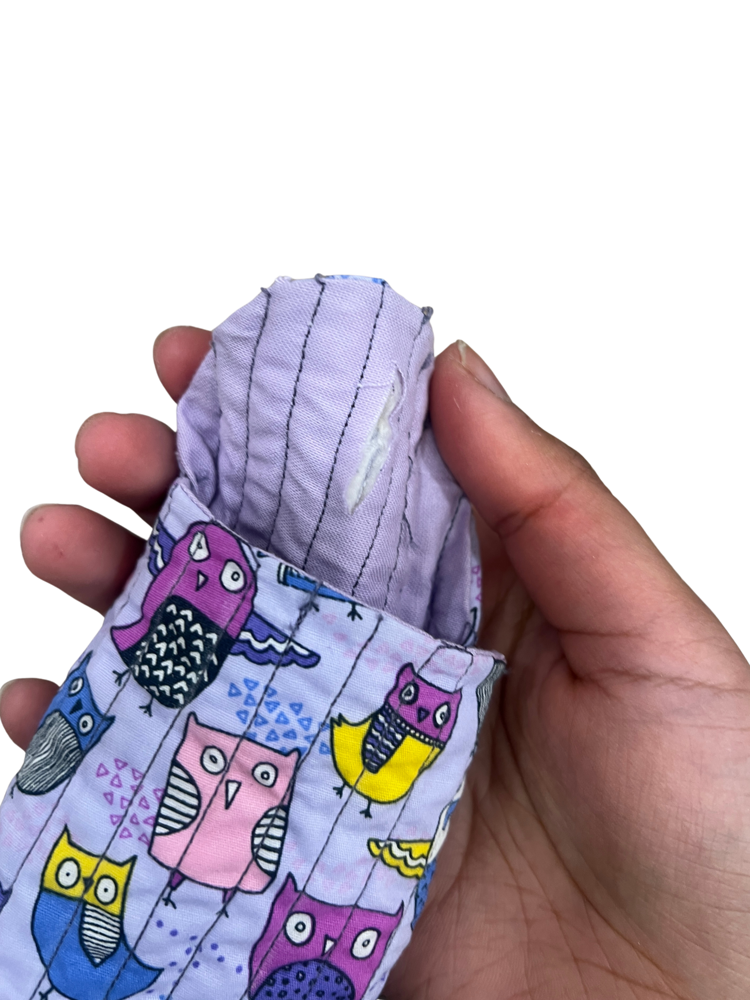
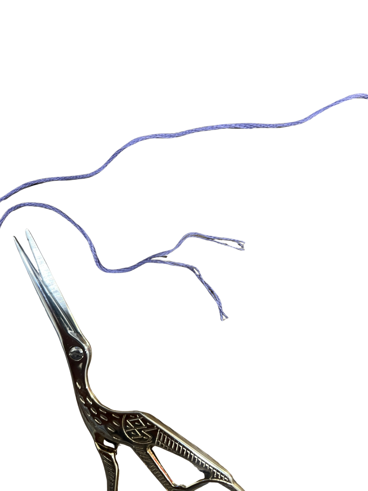
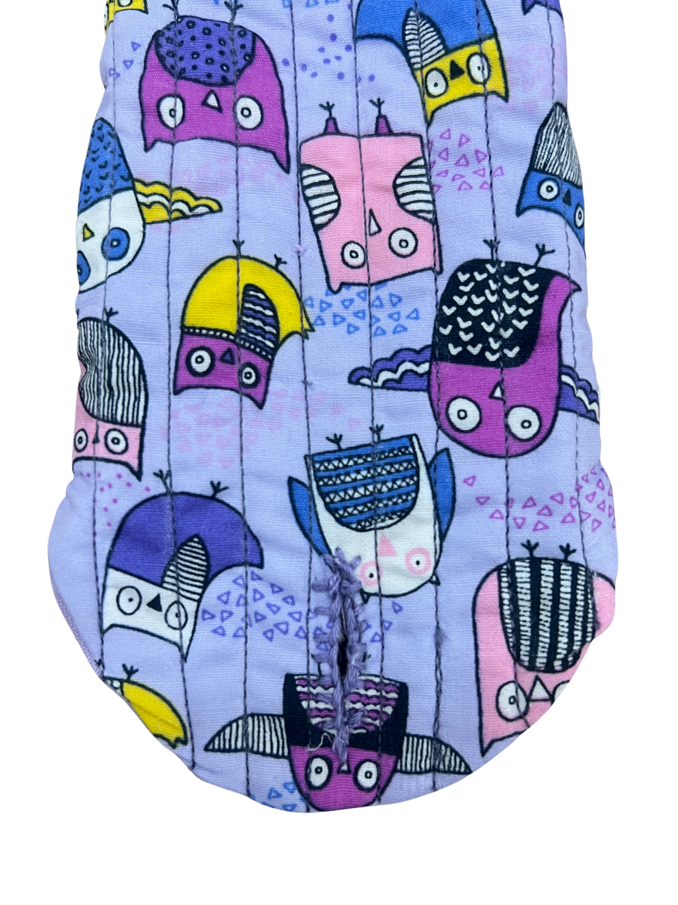
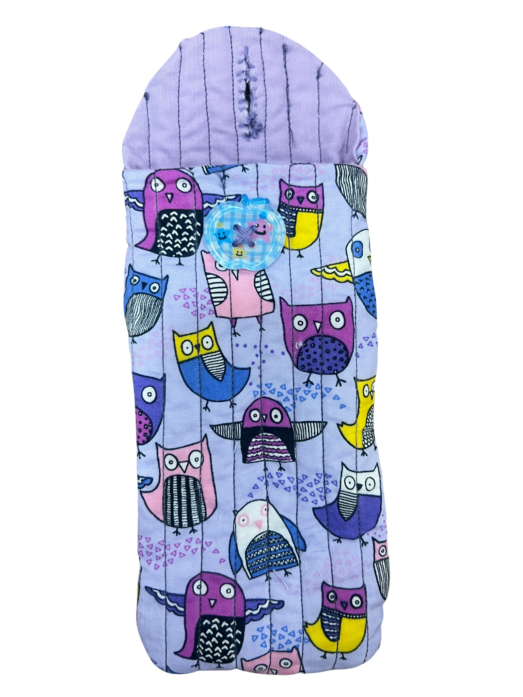

[← Back to Table of Contents](README.md) | [← Previous: Sewing Both Pieces Together](09-sewing-both-pieces-together.md)

# 10. Creating and Reinforcing the Buttonhole

Close the flap and determine where the buttonhole should be placed. Using your button as a guide, measure and mark a slit about the length of the button's diameter using tailor's chalk.

Carefully cut along the marked line using embroidery scissors.

Embroidery thread consists of six strands. Separate three strands and thread them through your embroidery needle. Using a blanket stitch, reinforce the raw edges of the buttonhole to prevent fraying. This technique can also be used to reinforce openings ("windows") in future wearable engineering projects where wires, sensors, or displays pass through the fabric.

📺 [Watch: Sewing a blanket stitch](https://www.youtube.com/watch?v=ofnBmni1k4o)

## Attaching the Button

Close the flap and align the completed buttonhole with the front of the pouch. Mark the button location using tailor's chalk. Thread your needle with three strands of embroidery thread and securely sew the button in place. Tie a knot on the inside of the pouch and trim any excess thread.

📺 [Watch: Sewing on a button](https://www.youtube.com/watch?v=AqUaOIXmdCQ)

Test the closure by fastening the button through the buttonhole. The button should fit snugly while still opening and closing easily.

Congratulations! You have now finished your first sewing project 🙂

---

[← Back to Table of Contents](README.md) | [← Previous: Sewing Both Pieces Together](09-sewing-both-pieces-together.md)
