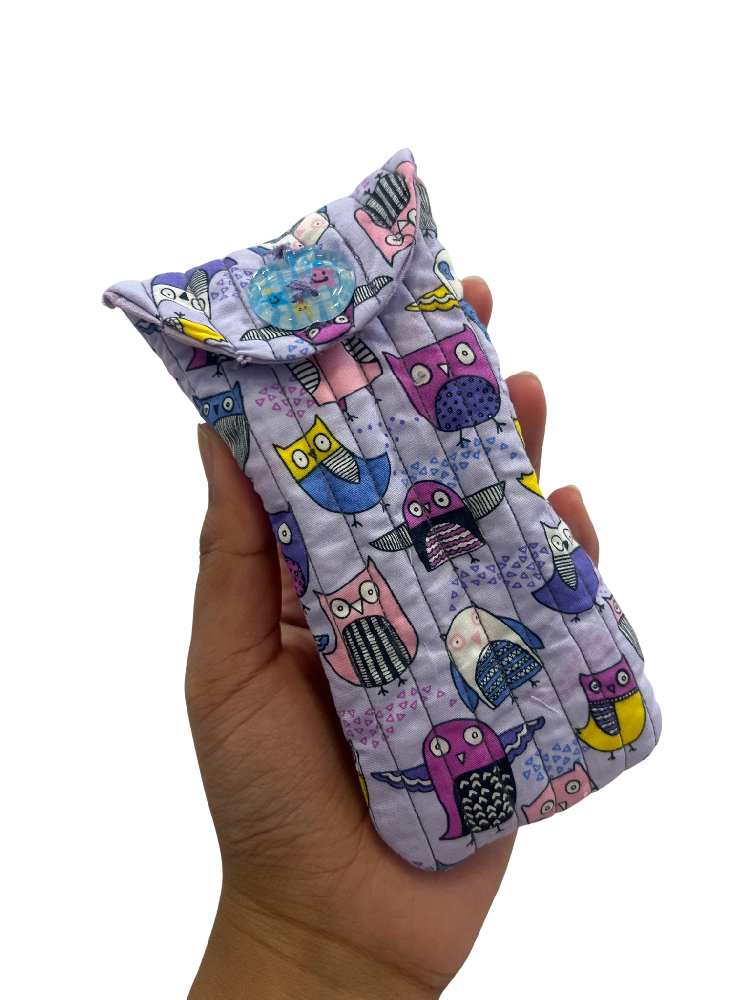

# Sewing Basics: Creating a Storage Pouch

## Overview

Machine sewing is a valuable skill for creating wearable engineering projects. In this tutorial, you'll learn how to safely operate a sewing machine, select appropriate fabrics, measure and cut materials, and assemble simple fabric components.

You'll build these skills by sewing a **glasses case** (or a phone pouch, if you'd rather make that instead). These foundational techniques — measuring, cutting, pinning, straight and reinforced stitching, and finishing edges — will help you create durable, comfortable wearables that can securely support prototypes and engineering devices.

By the end of this tutorial you will be able to:

- Select the right fabric weight and weave for a project
- Draft and use a reusable paper template
- Thread a sewing machine and sew a straight, backstitched seam
- Trim and finish curved seams
- Add quilting lines that double as wire channels for future electronics projects
- Create and reinforce a buttonhole and attach a button

> **Note:** One diagram referenced in the original source material (a color diagram of the paper template) was removed by the author pending a colorblind-accessible redesign, and hasn't been replaced yet. Step 3 of [Part 2: Creating the Template](02-creating-the-template.md) is text-only until that diagram is available.

## Table of Contents

1. [Materials and Fabric Selection](01-materials-and-fabric-selection.md) — What you'll need and how to choose the right fabric
2. [Creating the Template](02-creating-the-template.md) — Measuring your item and drafting a reusable paper pattern
3. [Cutting the Fabric](03-cutting-the-fabric.md) — Pressing fabric and cutting all pattern pieces
4. [Threading the Machine](04-threading-the-machine.md) — Getting your sewing machine ready to sew
5. [Sewing the Front and Back Pieces](05-sewing-front-and-back-pieces.md) — Pinning, sewing, and backstitching each side
6. [Trimming and Turning](06-trimming-and-turning.md) — Trimming seam allowances and turning pieces right-side out
7. [Adding Quilting Lines](07-adding-quilting-lines.md) — Decorative and functional stitching for wire routing
8. [Closing the Bottom Edge](08-closing-the-bottom-edge.md) — Hemming the opening used to turn the pouch
9. [Sewing Both Pieces Together](09-sewing-both-pieces-together.md) — Joining the outer pouch and inner lining
10. [Buttonhole and Button](10-buttonhole-and-button.md) — Creating, reinforcing, and closing the buttonhole

## Credits

- Photos in sections 1–10 (except where noted) taken by Myesha Zaman, IDEAS Clinic RA S2026.
- Backstitch diagram: designed by Myesha Zaman, IDEAS Clinic RA S2026.
- Woven vs. knit fabric illustration: adapted from [guangzhoufabric.com](https://guangzhoufabric.com/2025/05/05/knit-vs-woven-fabrics-whats-the-difference/).
